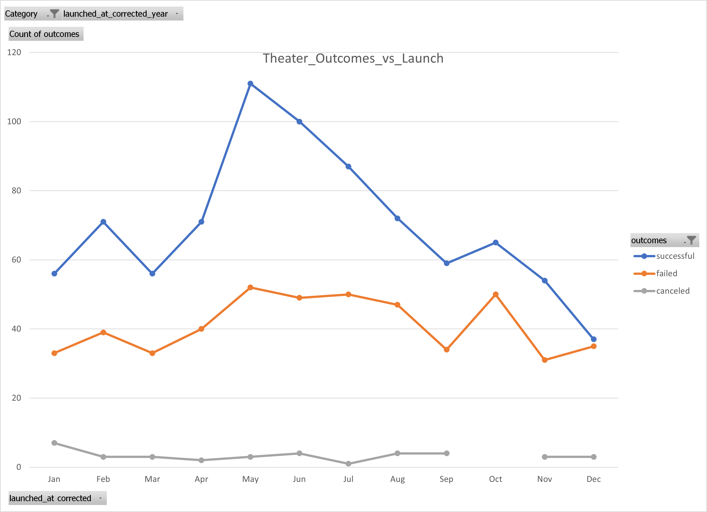
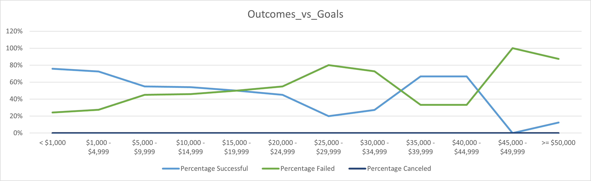

# kickstarter-analysis
UT Data analysis class - kickstarter project - module 1

# Kickstarting with Excel

## Overview of Project
This project evaluates data from Kickstarter campaigns from 2010 to 2017.

### Purpose
Within this dataset we pulled information specific to the success and failure rates of Theater/Play Kickstarter in order to offer guidance and recommendations for a prospective client and their campaign.

## Analysis and Challenges

### Analysis of Outcomes Based on Launch Date

- [Outcomes vs Launch Date Graph](resources/Theater_Outcomes_vs_Launch.png)
- Using a Pivot Table we filtered the dataset to campaigns related to Theater. And then pulled the month of campaign launch from each data point, and plotted that against the outcome  of the campaign.
- This data seems to suggest that there is a marginal increase in the campaigns success rate, if that Theater campaign is launched in the months of May or June.
  - With a Standard Deviation amongst the Successful Theater campagins in any given month being 20 successful campaigns from the Mean of 70, that there were 111 and 100 successful theater  campaigns in the months of May and June. We would suggest that the Client launch their campaign in these months.
  - However it is worth noting that there shows no significant variations in failures of theater campaigns within any given month, suggesting that there is more to the success/failure of each campaign than just the month that the campaign was launched on. 

### Analysis of Outcomes Based on Goals

- [Outcomes vs Goal Graph](resources/Outcomes_vs_Goals.png)
- Filtering the original dataset to only focus on Theater/Plays campaigns, and generated a graph to display the outcome of the campaign based on the goal amount described.
- We would suggest that the Client list their goal between $0 and $10,000. Campaigns in this category that set their goals within this range have the highest success rate.

### Challenges and Difficulties Encountered
- As a whole dataset the Kickstarter dataset campaign contains large outliers of both successful and failed campaigns and without proper filtering and adjusting for skew, the dataset might not be that performative. 

## Results

- What are two conclusions you can draw about the Outcomes based on Launch Date?
  - The dataset suggests that campaings that are launched within the months of May and June are most likely to be successful.
  - There is almost no decrease or increase in suggested chance of failure, based on this dataset, for the launch of any  campaign in any given month.

- What can you conclude about the Outcomes based on Goals?
  - Theater/Plays campaigns that set their goal at or above the $15,000 the campaign is more likely to fail.

- What are some limitations of this dataset?
  - A limitation of the dataset is that it ends in 2017, and our Client requesting our aide in 2021 would be working from outdated data.

- What are some other possible tables and/or graphs that we could create?
  - We could create a dataset and corresponding visual to express the relationship between whether a campaign received "Spotlight" or "Staff Picks" and the effect that was made on its outcome.
  - We could show a visual to express the relationship between the average backer amount and number of backers and the effect that was made on its outcome.

